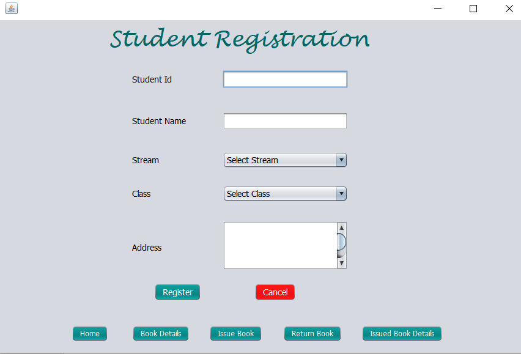
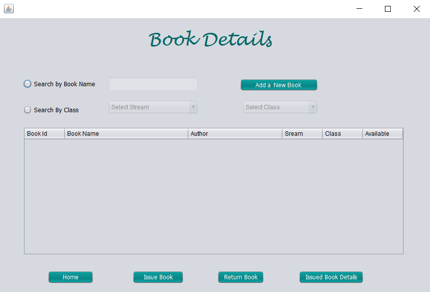
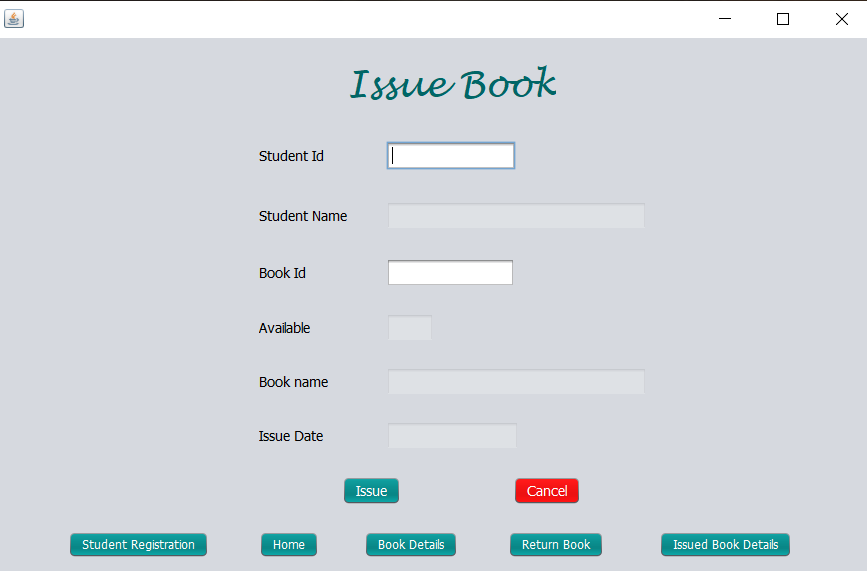
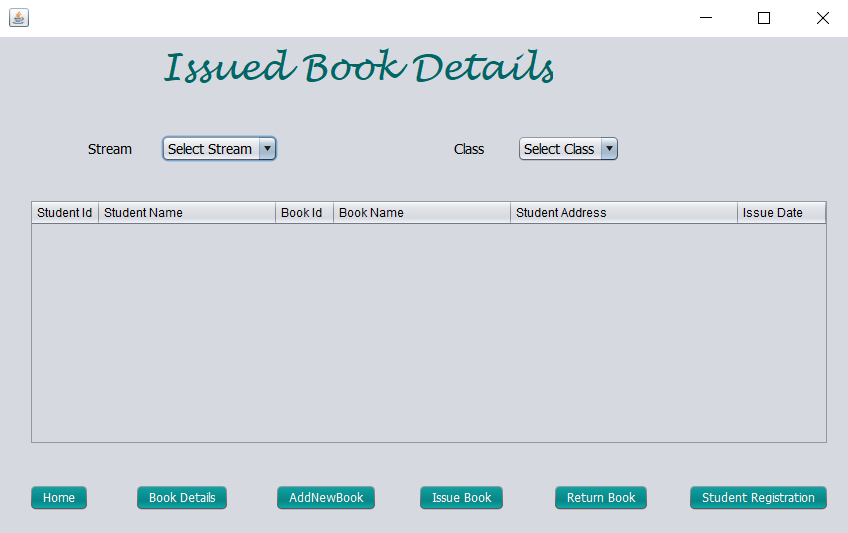
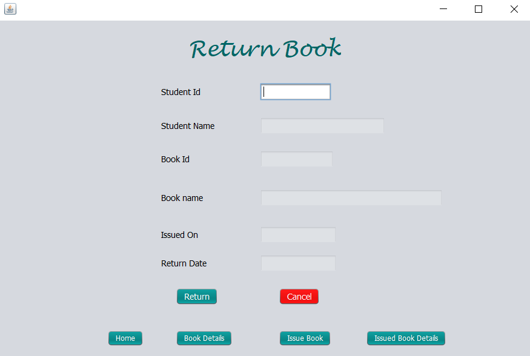
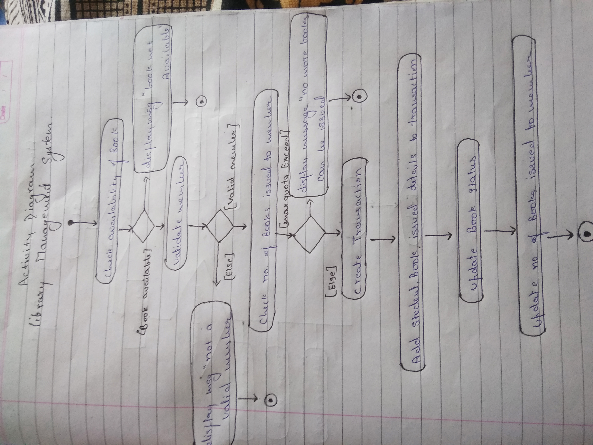

# LibraryManagementSystem
<b><u>Objective</b></u> 
The main objective of the Library Management System is to manage the details of Student, Books, Issues, Member. It manages all the information about the address, librarian, student, book. The project is totally build at administrative end and thus only the administrator is guaranteed the access. The purpose of the project is to build an application program to reduce the manual work for managing the address, member, issues and student. It tracks all the details about the Issues, Books, Student. 
 
<b>Users of system</b>
<ul><li>Student</li><li>Librarian</li><li>Member</li></ul>
<b>Functional Requirements</b> 
<ul><li>Student</li>
1.	Can register themselve.  
2.	Can login and logout.  
3.	Can view books details.  
4.	Can issue books and return books.  
 
<li>Librarian</li>
1.	Can view student details.  
2.	Can view student books which they issued.  
3.	Can view details of the book. 
</ul>
<b>Tools Used</b> 
1.	MySQL Community Server  
2.	MySQL JDBC Connector 
3.  Java 
4.  Eclipse IDE  
5.  rs2xml.jar 
   
<b>Working of Project with Screenshots</b> 
First page:- Student register their identity on STUDENT REGISTRATION page. 
 
This is the home page of the application, clicking the buttons will open a Book Details, Issue Book and Return Book will be displayed.  
 
If student wants to know the books details then click on BOOK DETAILS :- 
If librarian want to add new book into library then click on ADD A NEW BOOK  
 
To issue the book click the ISSUE BOOK section and enter the Student Id and book Id :- 
 
To know the details of issued book click on ISSUED BOOK DETAILS:- 
 
To return back the issued book to library click on the RETURN BOOK :-  
 

<b>Activity Diagram</b> 
 
<b>ER Diagram</b> 
 
<b>Data Flow Diagram</b> 
 
