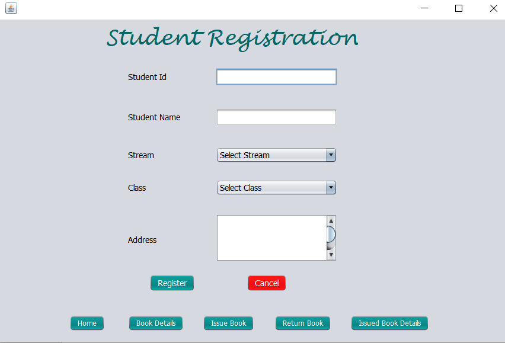
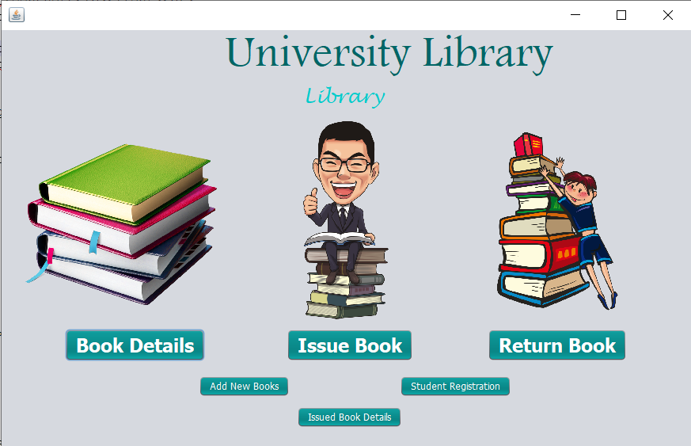
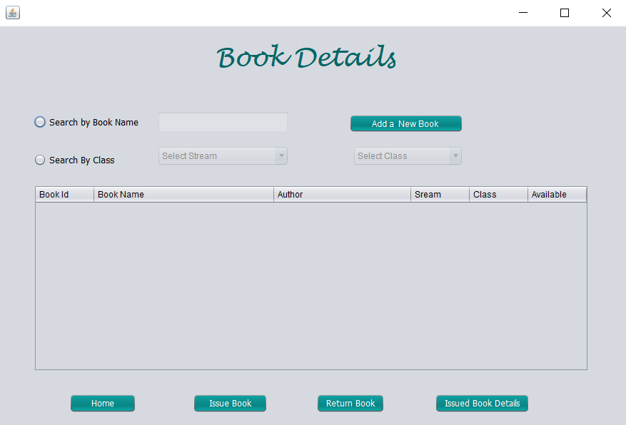
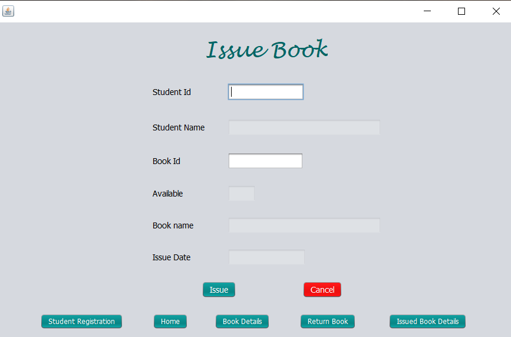
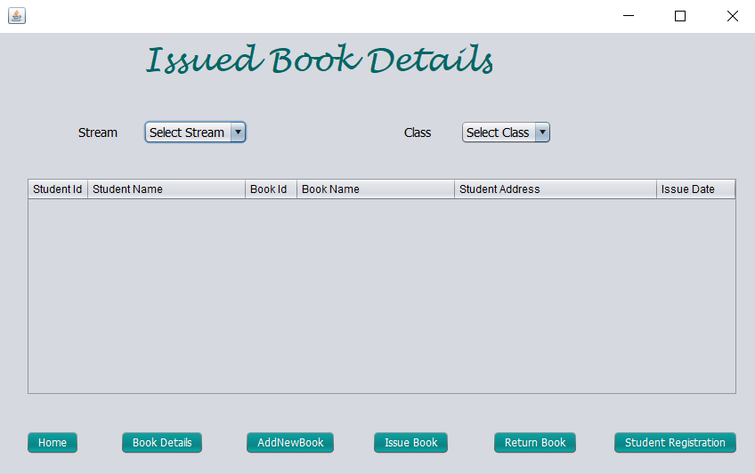
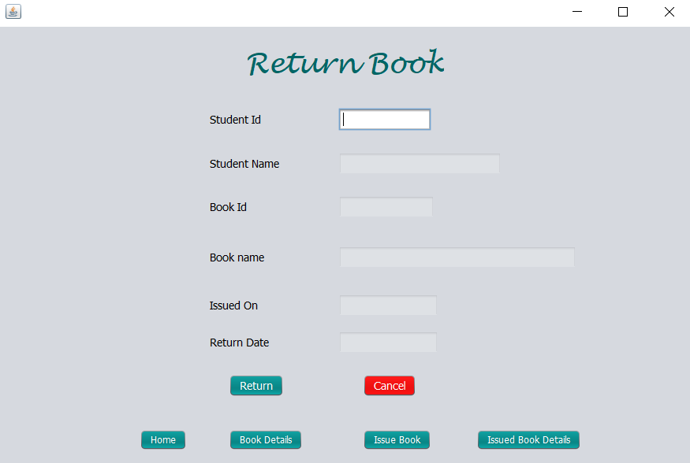

# Library Management System
<b><u>Objective</b></u> 
A college library management is a project that manages and stores books information electronically according to students needs. The system helps both students and library manager to keep a constant track of all the books available in the library. It allows both the admin and the student to search for the desired book. It becomes necessary for colleges to keep a continuous check on the books issued and returned and even calculate fine. This task if carried out manually will be tedious and includes chances of mistakes. These errors are avoided by allowing the system to keep track of information such as issue date, last date to return the book and even fine information and thus there is no need to keep manual track of this information which thereby avoids chances of mistakes.
 
The main objective of the Library Management System is to manage the details of Student, Books, Issues, Member. It manages all the information about the address, librarian, student, book. The project is totally build at administrative end and thus only the administrator is guaranteed the access. The purpose of the project is to build an application program to reduce the manual work for managing the address, member, issues and student. It tracks all the details about the Issues, Books, Student. 

<b>Users of system</b>
<ul>
 <li>Student</li>
 <li>Librarian</li>
 <li>Member</li>
</ul>
<b>Functional Requirements</b> 
<ul><li>Student</li>
1.	Can register themselve.  
2.	Can login and logout.  
3.	Can view books details.  
4.	Can issue books and return books. 
 
<li>Librarian</li>
1.	Can view student details.  
2.	Can view student books which they issued.
3.	Can view details of the book. 
</ul>
<b>Tools Used</b> 
<ul>
 <li>MySQL Community Server </li>
 <li>MySQL JDBC Connector</li>
 <li>Java</li>
 <li>Eclipse IDE </li>
 <li>rs2xml.jar</li>
  
 <b>Advantages</b>
 <ul>
 <li>The system excludes the use of paper work by managing all the book information electronically.</li>
 <li>Admin can keep updating the system by providing the new books arrival in system and their availability thus students need not to go to library for issuing purpose.</li>
 <li>The system has books well organized and systematically arranged in different categories in the system so that user can easily search and find the book.
</li>
 <li>Thus, it saves human efforts and resources.</li>
</ul>
<b>Disadvantages</b>
 <ul>
 <li>There is no human interaction if users have some enquiry.</li>
</ul>
  
<b>Working of Project with Screenshots</b> 
First page:- Student register their identity on STUDENT REGISTRATION page. 
 
This is the home page of the application, clicking the buttons will open a Book Details, Issue Book and Return Book will be displayed.  
 
If student wants to know the books details then click on BOOK DETAILS :- 
If librarian want to add new book into library then click on ADD A NEW BOOK  
 
To issue the book click the ISSUE BOOK section and enter the Student Id and book Id :- 
 
To know the details of issued book click on ISSUED BOOK DETAILS:- 
 
To return back the issued book to library click on the RETURN BOOK :-  
 

